[🇧🇷 Português](README.md) | 🇺🇸 English

# LogiInsight Agent - AI Assistant for Distribution Center

### Overview
Virtual assistant built as an AI agent (LangChain + LLM) designed to optimize operational queries and inventory management for the LogiInsight distribution center. The application has a Streamlit interface and operates by combining structured data (CSV) and unstructured data via RAG (PDF).
The solution offers autonomy and flexibility:
 - Autonomous decision-making: the agent interprets the natural language question and dynamically decides the best tool to answer it, executing data queries, Python calculations, chart generation, statistical reports, or searches in the process manual.
 - Data flexibility and reusability: by default the tool uses the LogiInsight CD-01 Distribution Center's base data and manual, but it allows users to upload their own files (CSV and PDF) through the interface.

---

### Accessing the application
> **Application running on Oracle Cloud Infrastructure (OCI):**
>
> - `https://logiinsight.com` *(domain mapped locally via hosts file, see note below)*
>
> - Public IP: `http://137.131.224.191:8501`
>
> ⚠️ To test the application, use the public IP link above, which works without local configuration.

**Note about the SSL certificate:** For the demonstration, a self-signed SSL certificate was used, with the domain mapped locally via the operating system's hosts file. Because of this, the browser will display an "insecure connection" warning when accessing via HTTPS, since the certificate was not issued by a public Certificate Authority. The connection remains encrypted, just without third-party identity validation. 
This approach is suitable for the context of this project (academic/demonstration), prioritizing a functional implementation of the solution. In a production scenario, the recommended approach would be to register a public domain and issue a valid certificate.

---

### Screenshot of the app running on OCI
- Access via domain (`https://logiinsight.com`), with a self-signed SSL certificate:

- Access via public IP (`http://137.131.224.191:8501`):


### Evidence of the OCI infrastructure
- OCI Compute instance running:
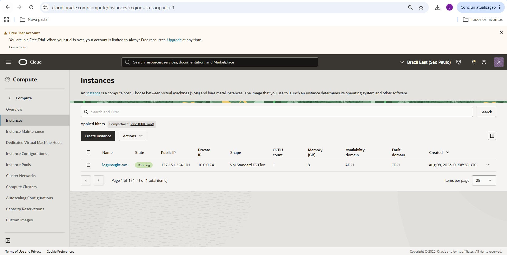
- Image published to OCI Container Registry (OCIR):
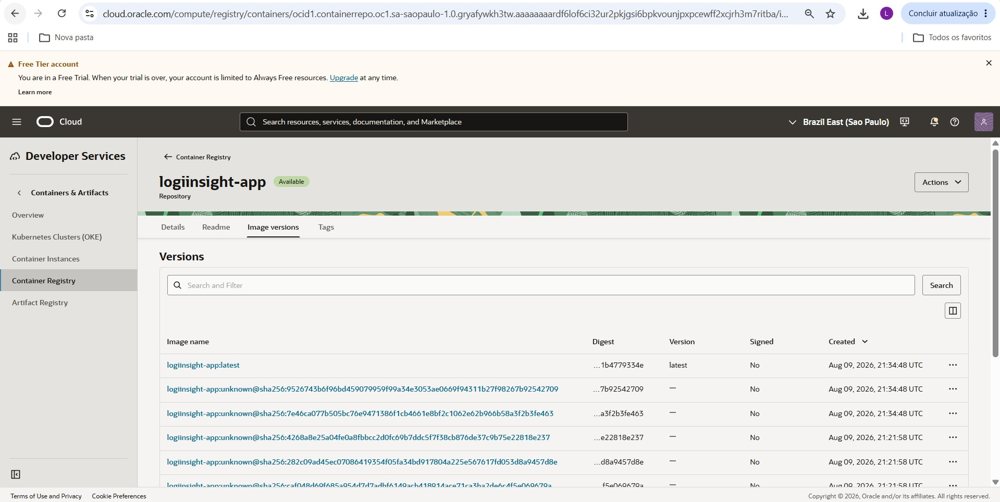
- Secret stored in OCI Vault:
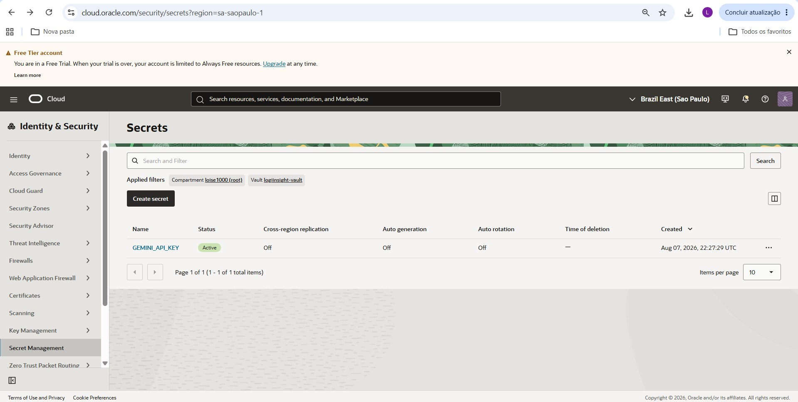

---

### Solution architecture

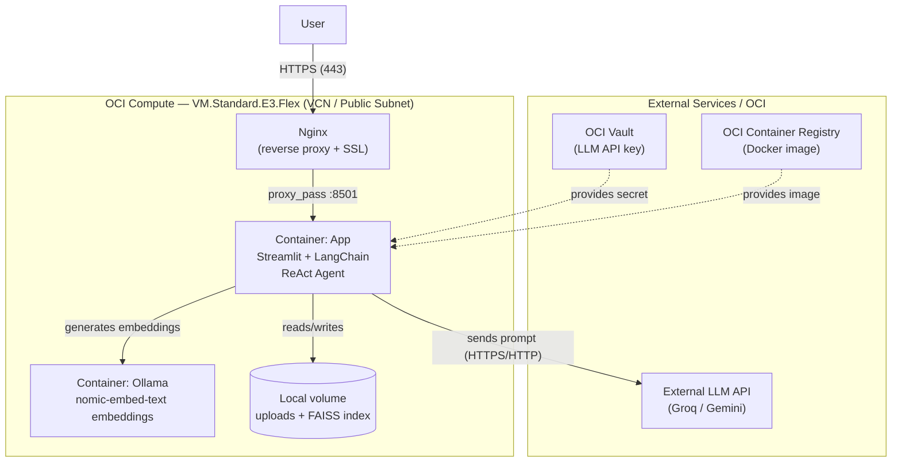

### Data flow
1. The user accesses the application in a web browser (HTTPS or HTTP).
2. **Nginx**, running on the VM, receives the request, terminates the SSL connection, and forwards it internally to the Streamlit container (port 8501).
3. The **ReAct agent** (LangChain) interprets the question and decides which tool to use: DataFrame queries, chart generation, Python code execution, statistical reports, product search, or manual lookup via RAG.
4. For questions about the procedures manual, the agent queries a **FAISS** vector index, built from embeddings generated by Ollama (`nomic-embed-text`) running in a separate container.
5. The language model (LLM) produces the final response and Streamlit displays it to the user.
6. The LLM API key is stored securely in **OCI Vault** and injected as an environment variable at runtime.

### Application layers
The implemented architecture consists of four layers:

1. **Frontend**
   - `App.py` is the Streamlit app that provides the web interface.
   - Allows uploading optional file, viewing a sample of the dataset, generating reports, asking questions, and generating charts.

2. **AI Agent**
   - The agent is implemented with **LangChain** and uses the **ReAct Agent** pattern.
   - It exposes a set of tools (`Tools.py`):
     - General DataFrame information.
     - Descriptive statistical report.
     - Chart generation.
     - Real-time Python code execution on the DataFrame.
     - Specific product search by SKU/EAN/name.
     - Inventory health analysis.
     - Procedures manual lookup via RAG.

3. **Data and retrieval**
   - The inventory CSV (`InventoryStock.csv`) is loaded as a `pandas.DataFrame`.
   - The PDF manual is indexed with **PyPDFLoader**, **FAISS**, and **Ollama** embeddings.
   - Questions about procedures are answered using only relevant excerpts extracted from the manual.

4. **Container-based deployment**
   - `Dockerfile` builds the app image based on `python:3.12-slim`.
   - `docker-compose.yml` defines two services:
     - `ollama`: service for local embeddings/vector search.
     - `app`: Streamlit service running the application.
   - The app connects to Ollama via `OLLAMA_BASE_URL=http://ollama:11434`.
   - The application image is published to **OCI Container Registry (OCIR)** and the LLM API key is retrieved at runtime from **OCI Vault**, so it is never exposed in code.

---

### Technologies and tools used
**Application:**
- **Python 3.12**
- **Streamlit:** the application's web interface
- **LangChain:** AI agent orchestration (ReAct pattern)
- **Google Gemini (`gemini-3.6-flash`)**: primary LLM, used in the current deployment
- **Groq (`llama-3.3-70b-versatile`)**: alternative LLM, tested during development
- **Ollama (`nomic-embed-text`)**: embedding generation for RAG
- **FAISS:** vector index for semantic search in the procedures manual
- **Pandas:** inventory data manipulation
- **Matplotlib/Seaborn:** chart generation
- **PyPDFLoader:** content extraction from the PDF manual
> **Note on the LLM:** During development, the agent was also tested with **Groq (`llama-3.3-70b-versatile`)**. The code in `App.py` and `Tools.py` keep both configuration blocks (Groq and Gemini) to switch between them, you just need to comment out the active provider's block and uncomment the other one in both files, and adjust the corresponding environment variable (`GROQ_API_KEY` or `GEMINI_API_KEY`) in `docker-compose.yml`.

**Infrastructure and deployment:**
- **Docker/Docker Compose:** containerization of the app and Ollama
- **Nginx:** reverse proxy and SSL termination
- **OCI Compute:** virtual machine (`VM.Standard.E3.Flex`, 1 OCPU / 8 GB, Oracle Linux 9) hosting the application
- **OCI Container Registry (OCIR):** private repository for the application's Docker image
- **OCI Vault:** secure storage for the LLM API key
- **OCI Networking (VCN):** dedicated virtual network, with public subnet, Internet Gateway, Route Table, and Security Lists configured
- **OCI CLI:** used on the VM to authentication and retrieval the Vault secret

---

### Repository structure
```
LogiInsightAgent/
├── .streamlit/
│   └── config.toml           # Streamlit server configuration
├── documentationImage        # Evidence images (OCI deployment and features)
├── App.py                    # Interface and agent orchestration
├── Tools.py                  # Agent tools (LangChain)
├── Dockerfile                # Application image build
├── docker-compose.yml        # Container orchestration (app + Ollama)
├── requirements.txt          # Python dependencies
├── InventoryStock.csv        # Default inventory dataset
├── WarehouseProceduresManual.pdf  # Default procedures manual
└── README.md
```

---

### How to run the project

### Prerequisites
- Docker and Docker Compose installed
- A valid Google Gemini or Groq API key

#### 1. Clone the repository
```bash
git clone <REPOSITORY_URL>
cd LogiInsightAgent
```

#### 2. Configure environment variables
Create a `.env` file at the project root (not included in the repo):
```
GEMINI_API_KEY=your_key_here
```

#### 3. Start the containers
```bash
docker compose build
docker compose up -d
```

#### 4. Download the embeddings model (first run)
```bash
docker exec -it $(docker ps -qf "name=ollama") ollama pull nomic-embed-text
```

#### 5. Access the application
```
http://localhost:8501
```

---

### Example of questions the agent can answer

The agent automatically chooses the appropriate tool based on the question:

| Category | Example question |
|---|---|
| General report | "I want a report with dataset information" |
| Descriptive statistics | "I want a descriptive statistics report" |
| Calculation | "What is the average of the quantidade_disponivel column?" |
| Inventory analysis | "Which products are low in stock?" |
| Inventory analysis | "What is the total value of inventory?" |
| Product search | "What are the details for SKU-1020?" |
| Product search | "Who is the supplier of the Sunscreen?" |
| Chart generation | "Create a chart of available quantity by category" |
| Procedures manual | "What should be done if the barcode is unreadable?" |
| Procedures manual | "How does order reservation work?" |
| Procedures manual | "Who can authorize releasing a vehicle without full inspection?" |

---

### Examples of responses generated by the agent
> **Note:** the agent is configured (via the base prompt in `Tools.py`) to always answer in Portuguese, regardless of the language used to ask the question, including when the question itself is written in English, as in the examples below. Responses are kept in their original Portuguese to accurately reflect what the application actually generates and to match the screenshots referenced alongside each example.

#### Example 1 — Procedures manual query (RAG)

**Question:** "What should be done if a barcode is unreadable?"

**Agent response:**
>Quando o código de barras (codigo_ean) estiver ilegível no item, a orientação do manual é:
>
>Ação esperada: Gerar uma etiqueta nova a partir do cadastro do SKU antes de validar a separação.
>Responsável pela decisão: Separador (Picker).

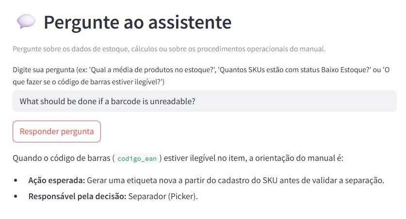

#### Example 2 — Chart generation

**Question:** "Create a chart of available quantity by category"

**Agent response:**
> import matplotlib.pyplot as plt
> import seaborn as sns
> 
> sns.set_theme()
> 
> df_categoria = (
>     df.groupby("categoria")["quantidade_disponivel"]
>     .sum()
>     .reset_index()
>     .sort_values(by="quantidade_disponivel", ascending=False)
> )
> 
> plt.figure(figsize=(8, 4))
> 
> ax = sns.barplot(
>     x="categoria", y="quantidade_disponivel", data=df_categoria, errorbar=None
> )
> 
> for container in ax.containers:
>     ax.bar_label(container, fmt="%.0f", padding=3, fontsize=9)
> 
> plt.title("Quantidade Disponível por Categoria", loc="left", pad=20, fontsize=14)
> plt.xlabel("Categoria")
> plt.ylabel("Quantidade Disponível")
> plt.xticks(rotation=45, ha="right")
> 
> sns.despine()
> plt.tight_layout()
> plt.show()

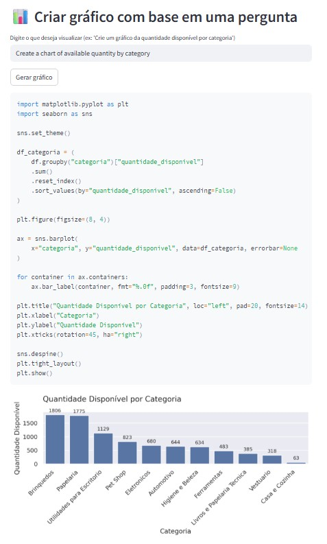

#### Example 3 — Inventory analysis

**Question:** "Which products are low in stock?"

**Agent response:**
> Produtos com estoque baixo
> Atualmente, identificamos 4 produtos que estão operando com a quantidade disponível abaixo do limite de estoque mínimo estabelecido. Seguem os itens e seus respectivos números:
> 
> 1. Furadeira de Impacto 750W (SKU-4541)
>   - Categoria: Ferramentas
>   - Disponível: 18 unidades | Estoque Mínimo: 50 unidades
> 2. Parafusadeira a Bateria (SKU-4822)
>   - Categoria: Ferramentas
>   - Disponível: 14 unidades | Estoque Mínimo: 25 unidades
> 3. Grampeador de Mesa (SKU-2887)
>   - Categoria: Papelaria
>   - Disponível: 16 unidades | Estoque Mínimo: 20 unidades
> 4. Sanduicheira (SKU-2127)
>   - Categoria: Casa e Cozinha
>   - Disponível: 34 unidades | Estoque Mínimo: 40 unidades

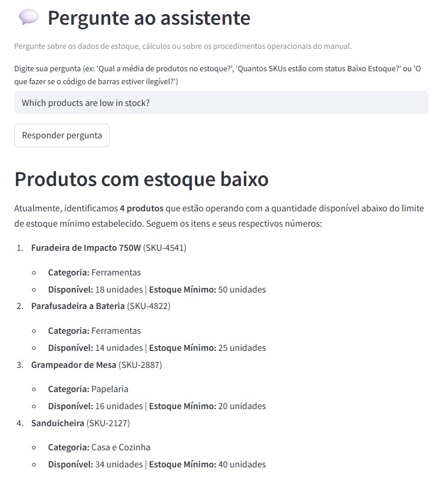

#### Example 4 — General information report

**Question:** "I want a report with dataset information"

**Agent response:**
> ## Relatório de informações gerais sobre o dataset
> 
> ### 1. Dimensão Total do DataFrame
O DataFrame possui um tamanho reduzido, composto por **44 linhas** (registros) e **20 colunas** (atributos).
> 
> ---
> 
> ### 2. Descrição das Colunas
> Abaixo está a relação de todas as colunas presentes no dataset, seus tipos de dados atuais e a representação de cada uma no contexto de gestão de estoque de um Centro de Distribuição (CD):
> 
> *   **`sku`** *(object)*: Código único de identificação do > produto (Stock Keeping Unit).
> *   **`codigo_ean`** *(float64)*: Código de barras internacional do produto (European Article Number), utilizado para bipagem e rastreio.
> *   **`produto`** *(object)*: Nome ou descrição comercial do item.
> *   **`categoria`** *(object)*: Agrupamento do produto por classe ou família (ex: Eletrônicos, Alimentos, Bebidas).
> *   **`quantidade_disponivel`** *(float64)*: Saldo físico do produto pronto para ser picado, embalado e expedido.
> *   **`quantidade_reservada`** *(float64)*: Unidades já comprometidas com pedidos em processamento que não podem ser vendidas novamente.
> *   **`estoque_minimo`** *(float64)*: Ponto de ressuprimento; limite mínimo que aciona a necessidade de nova compra para evitar desabastecimento (stockout).
> *   **`corredor`** *(object)*: Endereçamento físico da localização do produto (corredor do armazém).
> *   **`nivel_prateleira`** *(object)*: Altura ou nível da estrutura porta-paletes onde o item está armazenado.
> *   **`localizacao`** *(object)*: Código completo ou combinação de endereço no armazém (ex: Posição/Módulo).
> *   **`status`** *(object)*: Condição do item no sistema (ex: Ativo, Inativo, Bloqueado para Qualidade).
> *   **`fragil`** *(object)*: Indicador se o produto requer manuseio especial por ser quebrável (ex: Sim/Não).
> *   **`lote`** *(object)*: Identificação do lote de fabricação, essencial para controle de rastreabilidade e validade.
> *   **`dimensoes_cm`** *(object)*: Medidas do produto ou caixa (Comprimento x Largura x Altura) para cálculo de cubagem.
> *   **`peso_kg`** *(float64)*: Peso unitário do produto em quilos, importante para cálculo de frete e capacidade de carga de prateleiras.
> *   **`fornecedor`** *(object)*: Nome do fabricante ou distribuidor parceiro responsável pelo fornecimento do item.
> *   **`data_entrada`** *(object)*: Data em que o lote atual deu entrada fisicamente no CD.
> *   **`data_ultima_movimentacao`** *(object)*: Registro da última vez que o item sofreu movimentação (saída, transferência ou ajuste).
> *   **`custo_unitario`** *(float64)*: Valor de aquisição pago por unidade do produto.
> *   **`preco_venda;;;`** *(object)*: Preço final praticado para venda. *Nota: o nome da coluna apresenta ruído (ponto e vírgula ao final).*
> 
> ---
> 
> ### 3. Análise de Valores Nulos
> Foram identificados valores ausentes (`null`) na base de dados:
> *   **`sku`**: 0 valores nulos.
> *   **Todas as outras 19 colunas** (`codigo_ean`, `produto`, `categoria`, `quantidade_disponivel`, `quantidade_reservada`, `estoque_minimo`, `corredor`, `nivel_prateleira`, `localizacao`, `status`, `fragil`, `lote`, `dimensoes_cm`, `peso_kg`, `fornecedor`, `data_entrada`, `data_ultima_movimentacao`, `custo_unitario`, `preco_venda;;;`): **5 valores nulos em cada uma**.
> 
> ---
> 
> ### 4. Análise de Strings 'nan'
> Foi realizada uma verificação para identificar a presença da palavra `'nan'` armazenada em formato texto (comum em falhas de importação). 
> *   **Todas as 20 colunas contêm 0 ocorrências de strings 'nan'.**
> 
> ---
> 
> ### 5. Dados Duplicados
> *   Foi confirmada a existência de **4 linhas completamente duplicadas** na base de dados.
> 
> ---
> 
> ### 6. Possíveis Análises com os Dados
> A partir deste dataset, é possível realizar diversas análises estratégicas para a eficiência da cadeia de suprimentos:
> *   **Análise de Risco de Desabastecimento:** Comparação entre `quantidade_disponivel` e `estoque_minimo` para identificar produtos que precisam de reposição urgente.
> *   **Ocupação e Slotting (Layout de Armazém):** Mapeamento do uso do espaço usando `corredor`, `nivel_prateleira`, `dimensoes_cm` e `peso_kg` para otimizar as rotas de *picking* e a distribuição de peso no porta-paletes.
> *   **Giro de Estoque / Aging de Produtos:** Cruzamento das colunas `data_entrada` e `data_ultima_movimentacao` para identificar estoque parado (*dead stock*) ou itens de alta rotatividade.
> *   **Análise de Margem e Curva ABC:** Cálculo do markup financeiro relacionando `custo_unitario` e `preco_venda`, além da classificação ABC com base no valor total do estoque parado versus giro.
> 
> ---
> 
> ### 7. Recomendações de Tratamento dos Dados
> Para garantir a qualidade nas análises subsequentes, os seguintes passos de limpeza e tratamento são recomendados:
> 1.  **Remoção de duplicadas:** Excluir as **4 linhas duplicadas** para evitar contagem inflada de estoque.
> 2.  **Tratamento de nulos:** Investigar os 5 registros com dados nulos. Caso sejam linhas totalmente vazias, removê-las; caso contrário, aplicar métodos de imputação condizentes.
> 3.  **Renomeação e Correção de Cabeçalho:** Renomear a coluna `preco_venda;;;` removendo os caracteres especiais.
> 4.  **Ajuste de Tipos de Dados (Casting):**
>     *   Converter `data_entrada` e `data_ultima_movimentacao` de *object* para o tipo *datetime*.
>     *   Converter `preco_venda` de *object* para *float64* (após tratamento de caracteres monetários, se houver).
>     *   Converter `codigo_ean` para formato de texto (*string/object*), evitando a notação científica que ocorre no tipo *float*.
> 5.  **Engenharia de Recursos (Feature Engineering):** Decompor a coluna `dimensoes_cm` em três colunas distintas (*comprimento*, *largura*, *altura*) para facilitar cálculos de volume/cubagem.

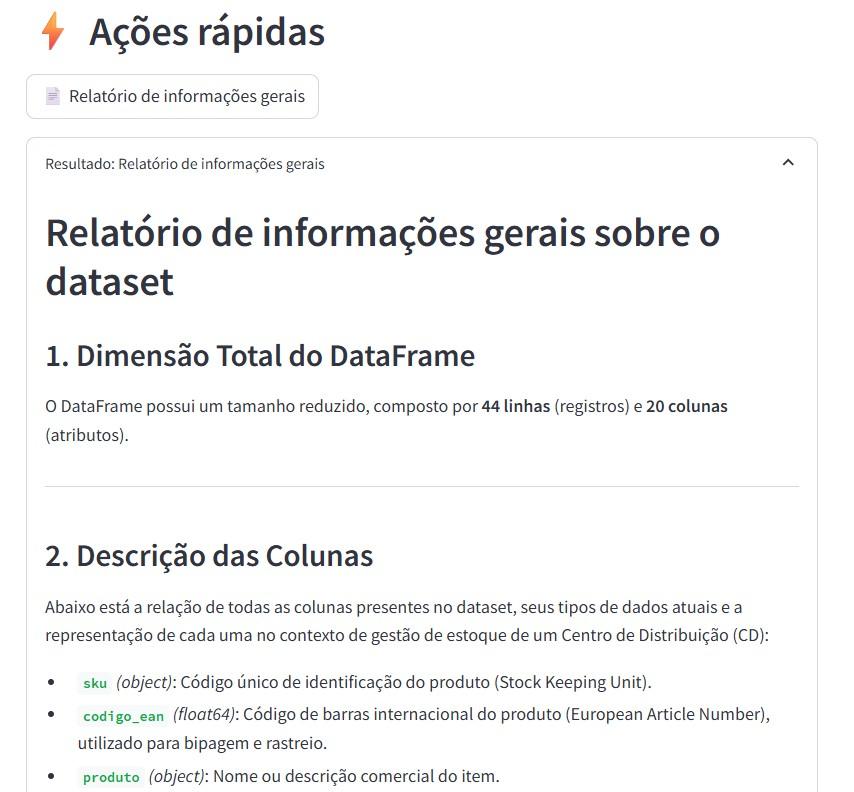

#### Example 5 — Calculation (Python code)

**Question:** "What is the average of the column quantidade_disponivel?"

**Agent response:**
> A média da coluna quantidade_disponivel no estoque é:
> 
> Média da quantidade disponível: 224,10

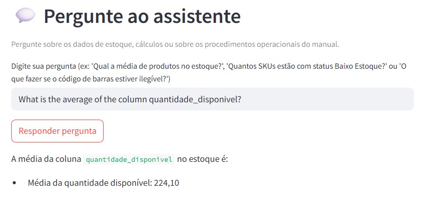

#### Example 6 — Specific product lookup

**Question:** "What is the location of SKU-2514?"

**Agent response:**
> A localização do produto SKU-2514 é A3-1 (Corredor A3, Nível 1 - Solo).

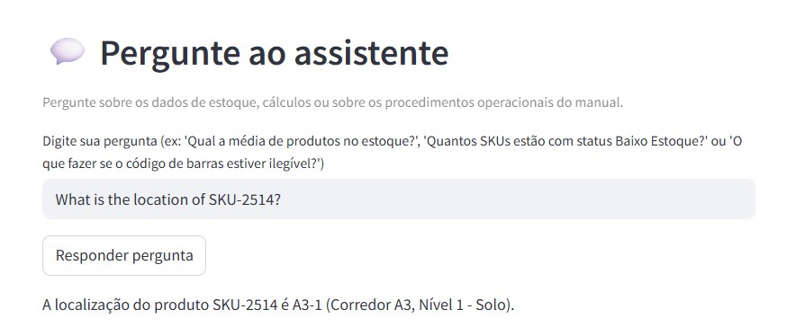

#### Example 7 — Statistical report

**Question:** "I want a statistical summary of the data"

**Agent response:**
> ## Relatório de estatísticas descritivas
> 
> ### Visão geral
> O conjunto de dados analisa trinta e nove produtos armazenados no centro de distribuição. As variáveis cobrem aspectos operacionais e financeiros, como identificação do produto, volume em estoque disponível e reservado, limites de segurança, peso físico e custo unitário. De modo geral, a base apresenta boa consistência, sem dados ausentes nas colunas analisadas, permitindo uma visão clara do perfil das mercadorias mantidas no galpão.
> 
> ### Análise detalhada por coluna
> 
> A coluna **codigo_ean** representa o código de barras padrão dos produtos, variando entre 7.890.192.000.000 e 7.899.969.000.000. Por se tratar de uma chave de identificação numérica, métricas como média e desvio padrão não possuem significado operacional, servindo apenas para confirmar que os itens seguem o padrão numérico brasileiro de treze dígitos.
> 
> A coluna **quantidade_disponivel** apresenta uma média de 224,10 unidades por produto, com uma mediana de 194,00 unidades. Os volumes variam desde um valor mínimo de 14,00 unidades até um máximo de 451,00 unidades. A amplitude relativa entre o primeiro quartil de 98,50 unidades e o terceiro quartil de 385,00 unidades indica uma distribuição diversificada de volume em estoque.
> 
> A coluna **quantidade_reservada** registra os itens já comprometidos com pedidos. A média é de 36,77 unidades e a mediana é de 36,00 unidades, demonstrando forte simetria no comportamento dessa variável. O valor mínimo é de 0,00 unidades (produtos sem reservas no momento) e o máximo atinge 80,00 unidades.
> 
> A coluna **estoque_minimo** define o limite de segurança cadastrado para o centro de distribuição. A média calculada é de 25,77 unidades, muito próxima da mediana de 25,00 unidades. Os limites variam entre o mínimo de 10,00 unidades e o máximo de 50,00 unidades, refletindo parâmetros operacionais bem padronizados para o conjunto de itens.
> 
> A coluna **peso_kg** avalia o peso unitário dos produtos em quilos. A média fica em 7,55 quilos e a mediana em 7,64 quilos. Os produtos variam desde itens leves de 0,20 quilos (200 gramas) até itens mais pesados de 13,54 quilos, com metade do catálogo pesando entre 4,14 quilos e 10,94 quilos.
> 
> A coluna **custo_unitario** detalha o valor financeiro de cada item. A média de custo é de R\$ 214,11, enquanto a mediana situa-se em R\$ 185,58. Há uma variação expressiva de preços, partindo de um valor mínimo de R\$ 18,04 até o valor máximo de R\$ 460,54 por unidade.
> 
> ### Identificação de pontos fora da curva e valores extremos
> 
> - **Estoque disponível em nível crítico:** O valor mínimo de 14,00 unidades na quantidade disponível é inferior à média do estoque mínimo exigido (25,77 unidades). Isso indica a existência de produtos operando abaixo da margem de segurança.
> - **Divergência de peso:** O peso mínimo de 0,20 quilos está bastante afastado do primeiro quartil (4,14 quilos), o que caracteriza um item muito mais leve que o padrão da operação.
> - **Amplitude de custos:** O custo máximo de R\$ 460,54 é mais de duas vezes superior à mediana (R\$ 185,58), destacando a presença de itens de alto valor agregado no estoque.
> 
> ### Recomendações de próximos passos
> 
> - Cruzar individualmente a quantidade disponível com o estoque mínimo de cada item para identificar quais códigos estão em situação iminente de desabastecimento.
> - Calcular o valor total imobilizado em estoque multiplicando a quantidade disponível pelo custo unitário de cada produto.
> - Realizar uma curva ABC baseada no custo unitário e no volume para priorizar a gestão dos itens de maior impacto financeiro.
> - Avaliar a capacidade de carga do centro de distribuição combinando o volume de itens com o peso total em quilos para otimização de espaço e transporte.

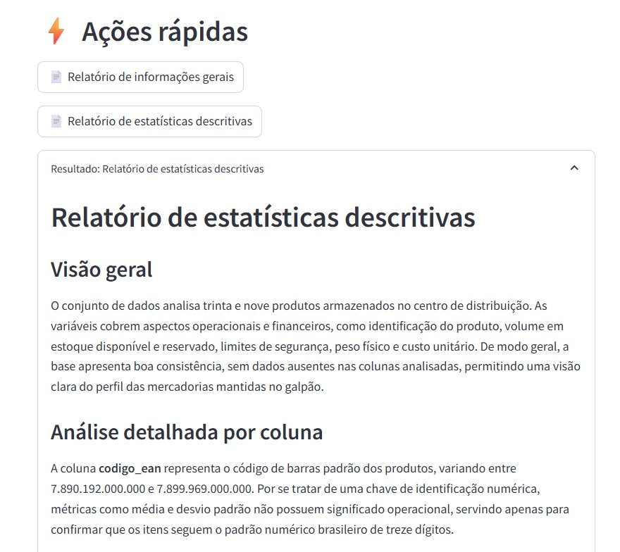

---

### OCI Deployment details
The deployment was carried out on Oracle Cloud Infrastructure, using the following services:

1. **Containerization:** the application (agent, RAG logic and dependencies) was packaged into a Docker image and published to **OCI Container Registry (OCIR)**.
2. **Compute:** the app runs on an **OCI Compute** instance (`VM.Standard.E3.Flex`) using Docker Compose.
3. **Secrets and credentials:** the LLM API key is stored in **OCI Vault** and retrieved dynamically on the VM via OCI CLI.
4. **Networking and security:** a dedicated **Virtual Cloud Network (VCN)** was configured with a public subnet, Internet Gateway, Route Table and Security Lists that allow only explicit traffic (SSH, HTTP, HTTPS).
5. **Reverse proxy and SSL:** an Nginx instance was configured on the machine itself to expose the application on standard web ports (80/443), with SSL termination.

### Justification of choices
- **OCI Compute** was chosen because it is a simple, straightforward option for a single-instance application, with no need for orchestration or auto-scaling at this stage of the project.
- **OCI Vault** was used to avoid exposing sensitive credentials in the source code.

---

### Limitations
- The SSL certificate used is self-signed (see note in the access section).
- The embeddings model (Ollama) runs locally on the VM, which requires an instance with sufficient memory (recommended minimum: 8 GB of RAM).
- The instance may be shut down outside of testing/demo periods to save credits. In that case, the access link may be temporarily unavailable.
