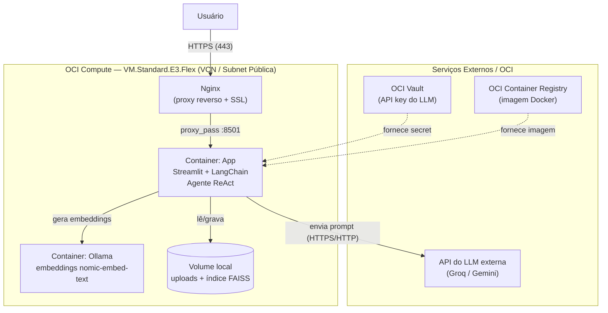
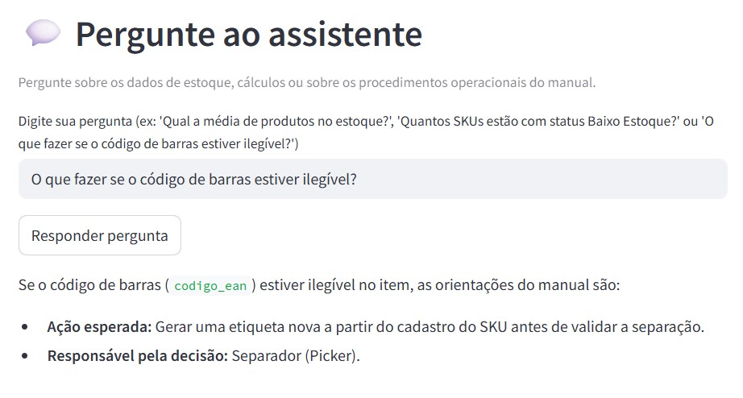
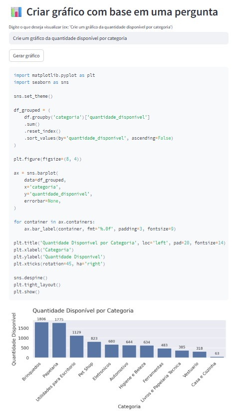
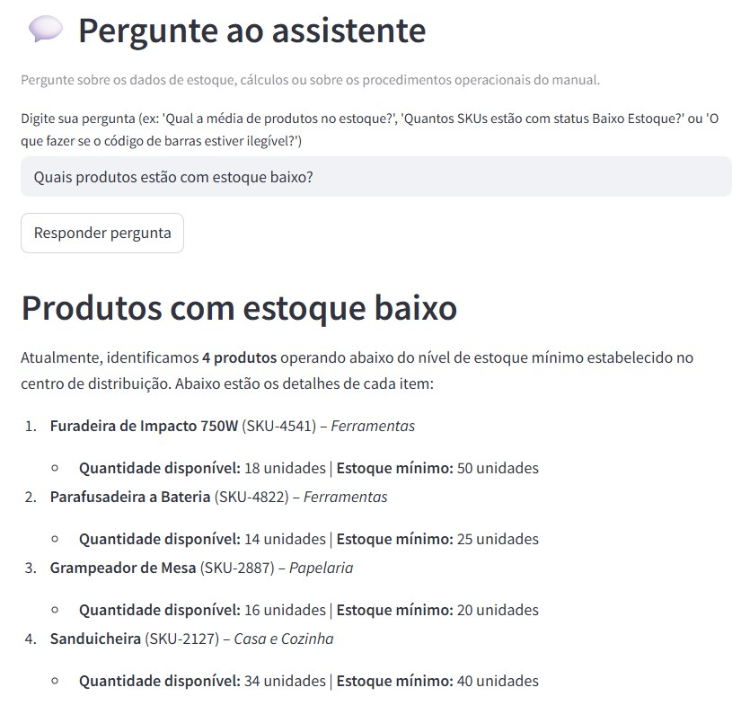
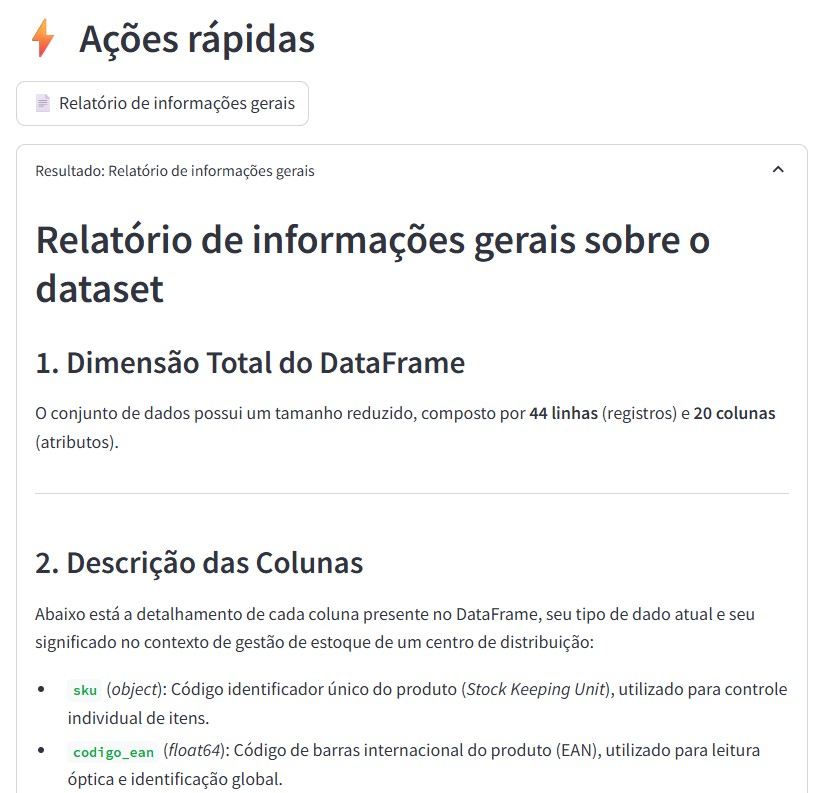
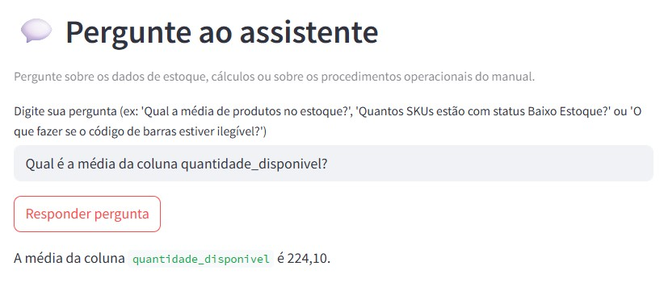
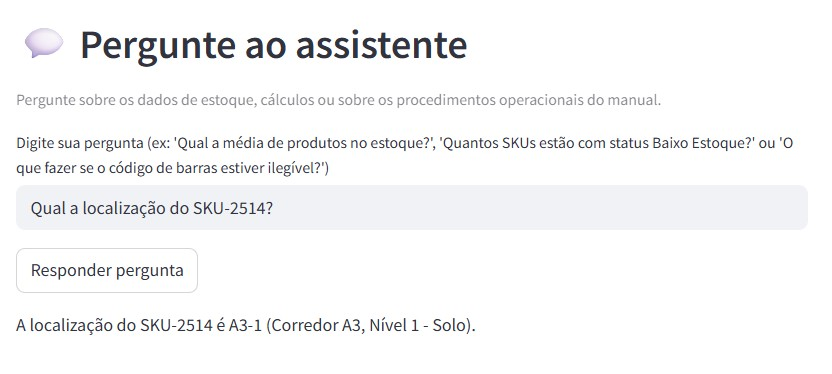

🇧🇷 Português | [🇺🇸 English](README.en.md)

# LogiInsight Agent - Assistente de IA para Centro de Distribuição

### Descrição geral
Assistente virtual baseado em um agente de IA (LangChain + LLM) projetado para otimizar as consultas operacionais e a gestão de estoque do centro de distribuição LogiInsight. A aplicação possui uma interface em Streamlit e opera combinando dados estruturados (CSV) e não estruturados via RAG (PDF).
A solução possui autonomia e flexibilidade:
 - Decisão Autônoma: O agente analisa a pergunta em linguagem natural e decide dinamicamente a melhor ferramenta para responder, executando consultas de dados, cálculos pontuais em Python, geração de gráficos, relatórios estatísticos ou buscas no manual de processos.
 - Flexibilidade de Dados e Reutilização: Por padrão, a ferramenta utiliza a base e o manual do Centro de Distribuição CD-01 da LogiInsight, mas permite que o usuário envie seus próprios arquivos (CSV e PDF) diretamente pela interface.

---

### Acesso à aplicação
> **Aplicação em execução na Oracle Cloud Infrastructure (OCI):**
> 
> - `https://logiinsight.com` *(domínio mapeado localmente via arquivo hosts, ver observação abaixo)*
>
> - IP público: `http://137.131.224.191:8501`
> 
> ⚠️ Para testar a aplicação, use o link do IP público acima, que funciona sem necessidade de configuração local.

**Observação sobre o certificado SSL:** para a demonstração, foi utilizado um certificado SSL autoassinado, com um domínio mapeado localmente via arquivo `hosts` do sistema operacional. Por isso, o navegador exibirá um aviso de "conexão não segura" ao acessar via HTTPS, visto que o certificado não foi emitido por uma Autoridade Certificadora pública. Assim, a conexão continua criptografada, apenas sem validação de identidade por terceiros.
Essa abordagem é adequada para o contexto deste projeto (acadêmico/demonstração), priorizando a implementação funcional da solução. Em um cenário de produção, o recomendado seria registrar um domínio público e emitir um certificado válido.

--- 

### Captura de tela da aplicação rodando na OCI
- Acesso via domínio (https://logiinsight.com), com certificado SSL autoassinado:

- Acesso via IP público (http://137.131.224.191:8501):


### Evidências da infraestrutura OCI
- Instância OCI Compute em execução:

- Imagem publicada no OCI Container Registry (OCIR):

- Segredo armazenado no OCI Vault:


---

### Arquitetura da solução



### Fluxo de dados
1. O usuário acessa a aplicação via navegador (HTTPS ou HTTP).
2. O **Nginx**, rodando na VM, recebe a requisição, termina a conexão SSL e repassa internamente para o container do Streamlit (porta 8501).
3. O **agente ReAct** (LangChain) interpreta a pergunta e decide qual ferramenta usar: consulta ao DataFrame, geração de gráfico, execução de código Python, relatório estatístico, busca de produto ou consulta do manual via RAG.
4. Para perguntas sobre o manual de procedimentos, o agente consulta um índice vetorial **FAISS**, criado a partir dos embeddings gerados pelo **Ollama** (modelo `nomic-embed-text`), rodando em um container separado.
5. O modelo de linguagem (LLM) processa a resposta final e o Streamlit a exibe ao usuário.
6. A chave de API do LLM é armazenada de forma segura no **OCI Vault** e injetada como variável de ambiente no momento da execução.

### Camadas da aplicação
A arquitetura implementada é composta por quatro camadas:

1. **Frontend**
   - `App.py` é o aplicativo Streamlit que fornece a interface web.
   - Permite carregar arquivos opcionais, visualizar a amostra do dataset, gerar relatório, enviar perguntas e gerar gráficos.

2. **Agente de IA**
   - O agente é montado com **LangChain** e usa o padrão **React Agent**.
   - Ele expõe um conjunto de ferramentas (`Tools.py`):
     - Informações gerais do DataFrame.
     - Relatório estatístico descritivo.
     - Geração de gráficos.
     - Execução de código Python em tempo real sobre o DataFrame.
     - Pesquisa específica de produtos por SKU/EAN/nome.
     - Análise de saúde do estoque.
     - Consulta ao manual de procedimentos via RAG.

3. **Dados e recuperação**
   - O CSV de estoque (`InventoryStock.csv`) é carregado como um `pandas.DataFrame`.
   - O manual em PDF é indexado com **PyPDFLoader**, **FAISS** e embeddings de **Ollama**.
   - As perguntas sobre procedimentos são respondidas usando apenas trechos relevantes extraídos do manual.

4. **Deploy com containers**
   - `Dockerfile` cria a imagem do app baseado em `python:3.12-slim`.
   - `docker-compose.yml` define dois serviços:
     - `ollama`: serviço para embeddings locais/busca vetorial.
     - `app`: serviço Streamlit que roda a aplicação.
   - O app se conecta ao Ollama via `OLLAMA_BASE_URL=http://ollama:11434`.
   - A imagem da aplicação é publicada no **OCI Container Registry (OCIR)** e a chave de API do LLM é recuperada em tempo de execução a partir do **OCI Vault**, assim não ficando exposta em código.

---

### Tecnologias e ferramentas utilizadas
**Aplicação:**
- **Python 3.12**
- **Streamlit:** interface web da aplicação
- **LangChain:** orquestração do agente de IA (padrão ReAct)
- **Google Gemini (`gemini-3.6-flash`):** modelo de linguagem (LLM) principal, utilizado no deploy atual
- **Groq (`llama-3.3-70b-versatile`):** modelo de linguagem (LLM) alternativo, testado durante o desenvolvimento
- **Ollama (`nomic-embed-text`):** geração de embeddings para o RAG
- **FAISS:** índice vetorial para busca semântica no manual de procedimentos
- **Pandas:** manipulação da base de estoque
- **Matplotlib/Seaborn:** geração de gráficos
- **PyPDFLoader:** extração de conteúdo do manual em PDF
> **Nota sobre o LLM:** durante o desenvolvimento, o agente também foi testado com **Groq (`llama-3.3-70b-versatile`)**. O código em `App.py` e `Tools.py` mantém os dois blocos de configuração (Groq e Gemini) para alternar entre eles, sendo necessário apenas comentar o bloco do provedor ativo e descomentar o bloco do outro em ambos os arquivos, além de ajustar a variável de ambiente correspondente (`GROQ_API_KEY` ou `GEMINI_API_KEY`) no `docker-compose.yml`.

**Infraestrutura e deploy:**
- **Docker/Docker Compose:** containerização da aplicação e do Ollama
- **Nginx:** proxy reverso e terminação SSL
- **OCI Compute:** máquina virtual (`VM.Standard.E3.Flex`, 1 OCPU / 8 GB, Oracle Linux 9) hospedando a aplicação
- **OCI Container Registry (OCIR):** repositório privado da imagem Docker da aplicação
- **OCI Vault:** armazenamento seguro da chave de API do LLM
- **OCI Networking (VCN):** rede virtual dedicada, com subnet pública, Internet Gateway, Route Table e Security Lists configuradas
- **OCI CLI:** utilizada na VM para autenticação e recuperação do segredo do Vault

---

### Estrutura do repositório
```
LogiInsightAgent/
├── .streamlit/
│   └── config.toml           # Configuração do servidor Streamlit
├── documentationImage        # Imagens de evidência (deploy OCI e funcionalidades)
├── App.py                    # Interface e orquestração do agente
├── Tools.py                  # Definição das ferramentas do agente (LangChain)
├── Dockerfile                # Build da imagem da aplicação
├── docker-compose.yml        # Orquestração dos containers (app + Ollama)
├── requirements.txt          # Dependências Python
├── InventoryStock.csv        # Base de estoque padrão
├── WarehouseProceduresManual.pdf  # Manual de procedimentos padrão
└── README.md
```

---

### Como executar o projeto

### Pré-requisitos
- Docker e Docker Compose instalados
- Uma chave de API válida do Google Gemini ou Groq

#### 1. Clonar o repositório
```bash
git clone <URL_DO_REPOSITORIO>
cd LogiInsightAgent
```

#### 2. Configurar a variável de ambiente
Crie um arquivo `.env` na raiz do projeto (não incluído no repositório):
```
GEMINI_API_KEY=sua_chave_aqui
```

#### 3. Subir os containers
```bash
docker compose build
docker compose up -d
```

#### 4. Baixar o modelo de embeddings (primeira execução)
```bash
docker exec -it $(docker ps -qf "name=ollama") ollama pull nomic-embed-text
```

#### 5. Acessar a aplicação
```
http://localhost:8501
```

---

### Exemplos de perguntas que o agente responde

O agente escolhe automaticamente a ferramenta adequada com base na pergunta:

| Categoria | Exemplo de pergunta |
|---|---|
| Relatório geral | *"Quero um relatório com informações sobre os dados"* |
| Estatísticas descritivas | *"Quero um relatório de estatísticas descritivas"* |
| Cálculo | *"Qual é a média da coluna quantidade_disponivel?"* |
| Análise de estoque | *"Quais produtos estão com estoque baixo?"* |
| Análise de estoque | *"Qual é o valor total do estoque?"* |
| Busca de produto | *"Quais são os dados do SKU-1020?"* |
| Busca de produto | *"Qual é o fornecedor do Protetor Solar?"* |
| Geração de gráfico | *"Crie um gráfico da quantidade disponível por categoria"* |
| Manual de procedimentos | *"O que fazer se o código de barras estiver ilegível?"* |
| Manual de procedimentos | *"Como funciona a reserva de pedidos?"* |
| Manual de procedimentos | *"Quem pode autorizar liberar um veículo sem conferência completa?"* |

---

### Exemplos de respostas geradas pelo agente

#### Exemplo 1 — Consulta ao manual de procedimentos (RAG)

**Pergunta:** *"O que fazer se o código de barras estiver ilegível?"*

**Resposta do agente:**
>Se o código de barras (codigo_ean) estiver ilegível no item, as orientações do manual são?
>
>- Ação esperada: Gerar uma etiqueta nova a partir do cadastro do SKU antes de validar a separação.
>- Responsável pela decisão: Separador (Picker).



#### Exemplo 2 — Geração de gráfico

**Pergunta:** *"Crie um gráfico da quantidade disponível por categoria"*

**Resposta do agente:**
> import matplotlib.pyplot as plt
> import seaborn as sns
> 
> sns.set_theme()
> 
> df_grouped = (
>     df.groupby('categoria')['quantidade_disponivel']
>     .sum()
>     .reset_index()
>     .sort_values(by='quantidade_disponivel', ascending=False)
> )
> 
> plt.figure(figsize=(8, 4))
> 
> ax = sns.barplot(
>     data=df_grouped,
>     x='categoria',
>     y='quantidade_disponivel',
>     errorbar=None,
> )
> 
> for container in ax.containers:
>     ax.bar_label(container, fmt='%.0f', padding=3, fontsize=9)
> 
> plt.title('Quantidade Disponível por Categoria', loc='left', pad=20, fontsize=14)
> plt.xlabel('Categoria')
> plt.ylabel('Quantidade Disponível')
> plt.xticks(rotation=45, ha='right')
> 
> sns.despine()
> plt.tight_layout()
> plt.show()



#### Exemplo 3 — Análise de estoque

**Pergunta:** *"Quais produtos estão com estoque baixo?"*

**Resposta do agente:**
> **Produtos com estoque baixo**
> Atualmente, identificamos 4 produtos operando abaixo do nível de estoque mínimo estabelecido no > centro de distribuição. Abaixo estão os detalhes de cada item:
> 1. Furadeira de Impacto 750W (SKU-4541) – Ferramentas
>   - Quantidade disponível: 18 unidades | Estoque mínimo: 50 unidades
> 2. Parafusadeira a Bateria (SKU-4822) – Ferramentas
>   - Quantidade disponível: 14 unidades | Estoque mínimo: 25 unidades
> 3. Grampeador de Mesa (SKU-2887) – Papelaria
>   - Quantidade disponível: 16 unidades | Estoque mínimo: 20 unidades
> 4. Sanduicheira (SKU-2127) – Casa e Cozinha
>   - Quantidade disponível: 34 unidades | Estoque mínimo: 40 unidades



#### Exemplo 4 — Relatório de informações gerais

**Pergunta:** *"Quero um relatório com informações sobre os dados"*

**Resposta do agente:**
> ## Relatório de informações gerais sobre o dataset
> 
> ### 1. Dimensão Total do DataFrame
> O conjunto de dados possui um tamanho reduzido, composto por **44 linhas** (registros) e **20 colunas** (atributos).
> 
> ---
> 
> ### 2. Descrição das Colunas
> Abaixo está a detalhamento de cada coluna presente no DataFrame, seu tipo de dado atual e seu significado no contexto de gestão de estoque de um centro de distribuição:
> 
> *   **`sku`** (*object*): Código identificador único do produto (*Stock Keeping Unit*), utilizado para controle individual de itens.
> *   **`codigo_ean`** (*float64*): Código de barras internacional do produto (EAN), utilizado para leitura óptica e identificação global.
> *   **`produto`** (*object*): Nome ou descrição comercial do item mantido em estoque.
> *   **`categoria`** (*object*): Classificação ou agrupamento do produto (ex: eletrônicos, alimentos, vestuário).
> *   **`quantidade_disponivel`** (*float64*): Quantidade física do produto pronta e livre para ser vendida ou expedida.
> *   **`quantidade_reservada`** (*float64*): Quantidade de itens comprometida com pedidos já efetuados, aguardando separação/envio.
> *   **`estoque_minimo`** (*float64*): Ponto de ressuprimento; limite mínimo de segurança para evitar desabastecimento (*stockout*).
> *   **`corredor`** (*object*): Identificação do corredor físico no centro de distribuição onde o item está armazenado.
> *   **`nivel_prateleira`** (*object*): Nível ou altura da prateleira na estrutura de armazenagem.
> *   **`localizacao`** (*object*): Código ou descrição completa do endereço logístico interno (bin/posição).
> *   **`status`** (*object*): Situação atual do item no sistema (ex: Ativo, Inativo, Esgotado, Em Quarentena).
> *   **`fragil`** (*object*): Indicador se o produto requer manuseio especial por ser quebrável ou delicado (ex: "Sim"/"Não" ou "True"/"False").
> *   **`lote`** (*object*): Identificador do lote de fabricação, essencial para rastreabilidade e controle de validade.
> *   **`dimensoes_cm`** (*object*): Medidas físicas do produto/embalagem em centímetros (geralmente no formato Comprimento x Largura x Altura).
> *   **`peso_kg`** (*float64*): Peso bruto ou líquido do produto em quilogramas, importante para cálculo de frete e ocupação de carga.
> *   **`fornecedor`** (*object*): Nome ou identificação da empresa responsável pelo fornecimento do produto.
> *   **`data_entrada`** (*object*): Data em que o lote/item deu entrada física no centro de distribuição.
> *   **`data_ultima_movimentacao`** (*object*): Data da última operação de entrada, saída ou transferência envolvendo este item.
> *   **`custo_unitario`** (*float64*): Valor de aquisição pago por unidade do produto.
> *   **`preco_venda;;;`** (*object*): Preço de venda ao consumidor final (observa-se a necessidade de correção no nome da coluna devido a caracteres especiais).
> 
> ---
> 
> ### 3. Valores Nulos
> A coluna `sku` **não possui** valores nulos (0 nulos). No entanto, todas as outras **19 colunas** do DataFrame contêm exatamente **5 valores nulos** cada. Isso indica que há 5 linhas que provavelmente estão completamente vazias ou incompletas na base.
> 
> ---
> 
> ### 4. Strings 'nan'
> Não foram identificadas ocorrências da string `'nan'` (em nenhuma variação de caixa alta/baixa) em nenhuma das colunas do DataFrame (0 em todas). Os valores ausentes presentes na base são do tipo nulo nativo (*NaN/None*).
> 
> ---
> 
> ### 5. Dados Duplicados
> Foram identificadas **4 linhas duplicadas** no conjunto de dados.
> 
> ---
> 
> ### 6. Análises Possíveis com os Dados
> Com esta base de dados, é possível realizar análises valiosas para a gestão operacional e financeira do centro de distribuição. Podemos calcular o **nível de serviço e risco de desabastecimento** identificando produtos cuja `quantidade_disponivel` está abaixo do `estoque_minimo`; mensurar a **valorização total do estoque** (estoque físico × `custo_unitario`) e a **margem de lucro potencial** comparando o custo com o `preco_venda`; avaliar o **Giro de Estoque e obsolescência** cruzando a `data_ultima_movimentacao` com a data atual para identificar "produtos encalhados"; e otimizar o **endereçamento logístico (layout do armazém)** ao analisar a distribuição de itens frágeis, pesados ou de alta rotatividade por `corredor` e `nivel_prateleira`.
> 
> ---
> 
> ### 7. Tratamentos Sugeridos nos Dados
> Para garantir a qualidade das análises e evitar erros em modelos futuros, diversos passos de limpeza e tratamento são recomendados. Primeiramente, deve-se **remover as 4 linhas duplicadas** e investigar/tratar os **5 registros nulos** (que provavelmente representam linhas em branco a serem descartadas). Em seguida, é necessário fazer a **renomeação da coluna `preco_venda;;;`** para eliminar os caracteres indesejados. Quanto à conversão de tipos de dados, as colunas `data_entrada` e `data_ultima_movimentacao` devem ser convertidas para o tipo *datetime*; a coluna `preco_venda` deve ser tratada e convertida para *float*; a coluna `codigo_ean` deve ser convertida para *string* (evitando exibição com casas decimais); e a coluna `dimensoes_cm` pode ser desmembrada em três colunas numéricas distintas (*comprimento*, *largura* e *altura*) para facilitar cálculos de volume (m³).



#### Exemplo 5 — Cálculo (código Python)

**Pergunta:** *"Qual é a média da coluna quantidade_disponivel?"*

**Resposta do agente:**
> A média da coluna quantidade_disponivel é 224,10.



#### Exemplo 6 — Busca de produto específico

**Pergunta:** *"Qual a localização do SKU-2514?"*

**Resposta do agente:** 
> A localização do SKU-2514 é A3-1 (Corredor A3, Nível 1 - Solo).



#### Exemplo 7 — Relatório estatístico

**Pergunta:** *"Quero um resumo estatístico sobre os dados"*

**Resposta do agente:** 
> ## Relatório de estatísticas descritivas
> 
> ### Visão geral
> O conjunto de dados analisa trinta e nove produtos armazenados no centro de distribuição. As variáveis cobrem aspectos operacionais e financeiros, como identificação do produto, volume em estoque disponível e reservado, limites de segurança, peso físico e custo unitário. De modo geral, a base apresenta boa consistência, sem dados ausentes nas colunas analisadas, permitindo uma visão clara do perfil das mercadorias mantidas no galpão.
> 
> ### Análise detalhada por coluna
> 
> A coluna **codigo_ean** representa o código de barras padrão dos produtos, variando entre 7.890.192.000.000 e 7.899.969.000.000. Por se tratar de uma chave de identificação numérica, métricas como média e desvio padrão não possuem significado operacional, servindo apenas para confirmar que os itens seguem o padrão numérico brasileiro de treze dígitos.
> 
> A coluna **quantidade_disponivel** apresenta uma média de 224,10 unidades por produto, com uma mediana de 194,00 unidades. Os volumes variam desde um valor mínimo de 14,00 unidades até um máximo de 451,00 unidades. A amplitude relativa entre o primeiro quartil de 98,50 unidades e o terceiro quartil de 385,00 unidades indica uma distribuição diversificada de volume em estoque.
> 
> A coluna **quantidade_reservada** registra os itens já comprometidos com pedidos. A média é de 36,77 unidades e a mediana é de 36,00 unidades, demonstrando forte simetria no comportamento dessa variável. O valor mínimo é de 0,00 unidades (produtos sem reservas no momento) e o máximo atinge 80,00 unidades.
> 
> A coluna **estoque_minimo** define o limite de segurança cadastrado para o centro de distribuição. A média calculada é de 25,77 unidades, muito próxima da mediana de 25,00 unidades. Os limites variam entre o mínimo de 10,00 unidades e o máximo de 50,00 unidades, refletindo parâmetros operacionais bem padronizados para o conjunto de itens.
> 
> A coluna **peso_kg** avalia o peso unitário dos produtos em quilos. A média fica em 7,55 quilos e a mediana em 7,64 quilos. Os produtos variam desde itens leves de 0,20 quilos (200 gramas) até itens mais pesados de 13,54 quilos, com metade do catálogo pesando entre 4,14 quilos e 10,94 quilos.
> 
> A coluna **custo_unitario** detalha o valor financeiro de cada item. A média de custo é de R\$ 214,11, enquanto a mediana situa-se em R\$ 185,58. Há uma variação expressiva de preços, partindo de um valor mínimo de R\$ 18,04 até o valor máximo de R\$ 460,54 por unidade.
> 
> ### Identificação de pontos fora da curva e valores extremos
> 
> - **Estoque disponível em nível crítico:** O valor mínimo de 14,00 unidades na quantidade disponível é inferior à média do estoque mínimo exigido (25,77 unidades). Isso indica a existência de produtos operando abaixo da margem de segurança.
> - **Divergência de peso:** O peso mínimo de 0,20 quilos está bastante afastado do primeiro quartil (4,14 quilos), o que caracteriza um item muito mais leve que o padrão da operação.
> - **Amplitude de custos:** O custo máximo de R\$ 460,54 é mais de duas vezes superior à mediana (R\$ 185,58), destacando a presença de itens de alto valor agregado no estoque.
> 
> ### Recomendações de próximos passos
> 
> - Cruzar individualmente a quantidade disponível com o estoque mínimo de cada item para identificar quais códigos estão em situação iminente de desabastecimento.
> - Calcular o valor total imobilizado em estoque multiplicando a quantidade disponível pelo custo unitário de cada produto.
> - Realizar uma curva ABC baseada no custo unitário e no volume para priorizar a gestão dos itens de maior impacto financeiro.
> - Avaliar a capacidade de carga do centro de distribuição combinando o volume de itens com o peso total em quilos para otimização de espaço e transporte.


---

### Detalhes do deploy na OCI
O deploy foi realizado na Oracle Cloud Infrastructure, utilizando os serviços:

1. **Containerização**: a aplicação (agente, lógica de RAG e dependências) foi empacotada em uma imagem Docker e publicada no **OCI Container Registry (OCIR)**.
2. **Compute**: a aplicação roda em uma instância **OCI Compute** (`VM.Standard.E3.Flex`), executando os containers via Docker Compose.
3. **Segredos e credenciais**: a chave de API do LLM é armazenada no **OCI Vault** e recuperada dinamicamente na VM via OCI CLI.
4. **Rede e segurança**: foi configurada uma **Virtual Cloud Network (VCN)** dedicada, com subnet pública, Internet Gateway, Route Table e Security Lists controlando explicitamente o tráfego permitido (SSH, HTTP e HTTPS).
5. **Proxy reverso e SSL**: um **Nginx** foi configurado na própria instância para expor a aplicação nas portas padrão da web (80/443), com terminação SSL.

### Justificativa das escolhas
- **OCI Compute** foi escolhido por ser uma opção simples e direta para uma aplicação de instância única, sem necessidade de orquestração e escalonamento automático nesta fase do projeto.
- **OCI Vault** foi utilizado para não expor credenciais sensíveis no código-fonte.

---

### Limitações
- O certificado SSL utilizado é autoassinado (ver observação na seção de acesso).
- O modelo de embeddings (Ollama) roda localmente na VM, o que exige uma instância com memória suficiente (mínimo recomendado: 8 GB de RAM).
- A instância pode ser desligada fora dos períodos de teste/demonstração para economia de créditos. Nesse caso, o link de acesso pode ficar temporariamente indisponível.

